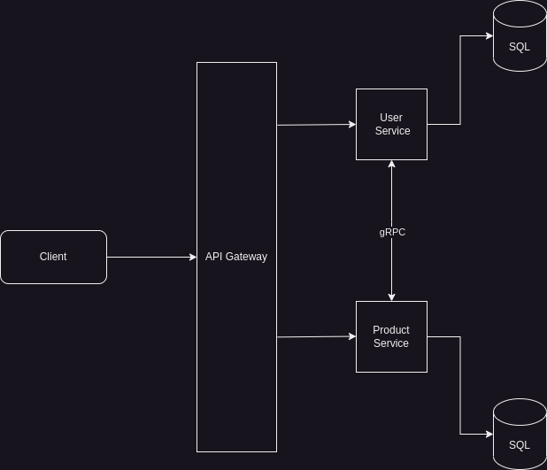

# EcomMaster Overview (In progress....)

EcomMaster is an e-commerce platform designed to demonstrate the use of microservices and various technologies. It consists of multiple services handling different functionalities such as API Gateway, user management, product catalog, cart, order management, product reviews, and notifications.
## Table of Contents

- [EcomMaster Overview (In progress....)](#ecommaster-overview-in-progress)
  - [Table of Contents](#table-of-contents)
  - [Microservices Breakdown](#microservices-breakdown)
  - [Technology Stacks](#technology-stacks)
  - [Architecture](#architecture)

## Microservices Breakdown

1. **User Service**:  User registration, authentication, and profile management.
2. **Product Catalog Service**: Manages product catalog, inventory, and categories.
3. **Cart Service**: Handles shopping cart functionality.
4. **Order Service**: Manages order creation, payments, and order history.
5. **Review Service**: Handles product reviews and ratings.
6. **Notification Service**: Sends emails or notifications (e.g., order confirmation).
7. **API Gateway**: Routes requests to the appropriate microservice.

## Technology Stacks

| **Component**    | **Technology**             |
| ---------------- | -------------------------- |
| Language         | Golang                     |
| Framework        | Gin, gRPC                  |
| Database         | PostgreSQL, MongoDB, Redis |
| Message Broker   | RabbitMQ                   |
| Containerization | Docker                     |
| Orchestration    | Kubernetes                 |
| Communication    | gRPC, REST                 |
| DevOps           | Jenkins                    |

## Architecture
